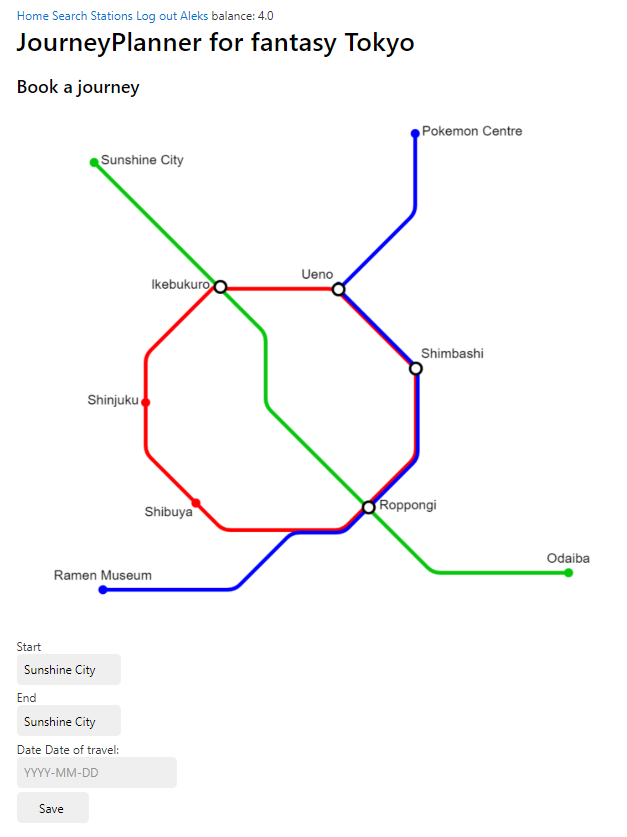
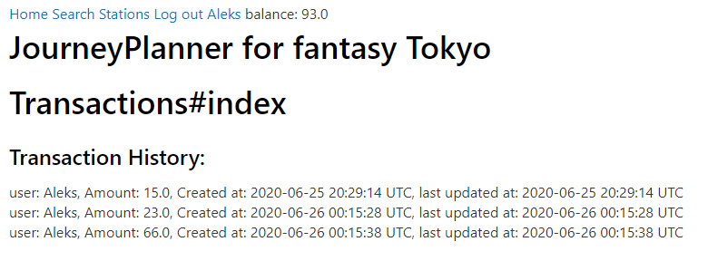
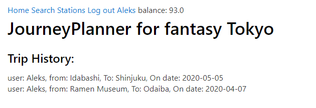

# Journey Planner
[visit the live project](https://frozen-castle-64427.herokuapp.com/)
## Introduction

This project intends to act as a journey planner for the tokyo metro system. 
It aims to allow a user to find the shorest path between different nodes on the rail network, and allow them to keep track of the cost of their trips, and the total amount of cash in their bank.

It also allows a user to search for train stations across the rest of Japan based off of a postcode. 

## Technologies

This is a Ruby On Rails based project that employs external gems, including one to provide railway network information and a gem to enable the postgres database for storing account and trip information. 

## Launching the project
The following commands should be sufficient to launch a local version of the project on the specified port
```
sudo service start posgresql

rails db:create && rails db:migrate && rails db:seed
rails server -p port
```
To deploy to heroku, run the following commands:
```
git add . 
git commit -m 'message
heroku create
heroku run rake db:migrate
heroku run rake db:seed
```
And your project should be live on heroku. 

## Todo
See `projects/mvp` for an up to date list of [upcoming features](https://github.com/gorff/JourneyPlanner/projects/1). 

The main planned new features are:
- [ ] breadth first search for finding distances between stations
- [ ] Allow admin to add more stations and the edges between them and edge length
- [ ] Allow start/end of trip selection by clicking stations in the image, rather than using dropdown
 
## Examples
### Booking a trip


### See all of the users transactions


### See all of the users Trips


### Searching stations by postcode

